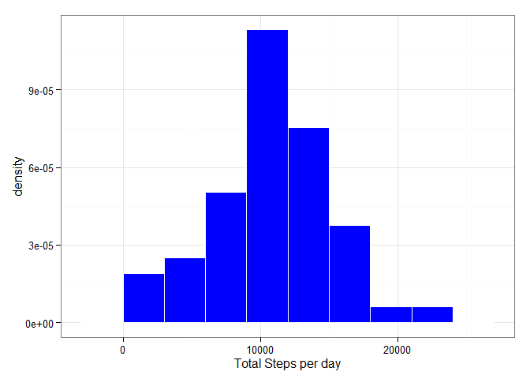
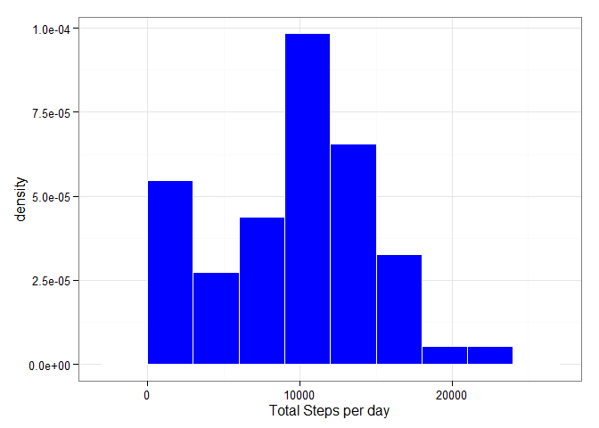
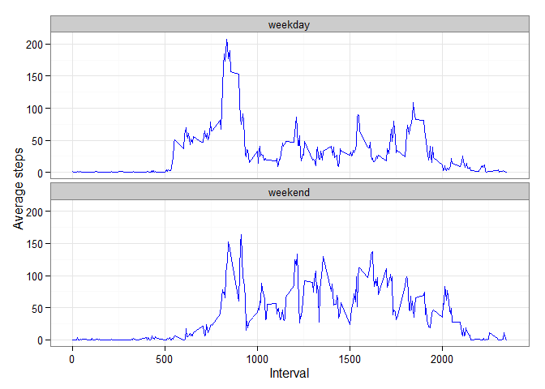

# Reproducible Research: Peer Assessment 1


## Loading and preprocessing the data
For this exercise we need the `ggplot2` package for plotting and `dplyr` package for proccessing data


```r
library(ggplot2)
library(dplyr)
```

```
## 
## Attaching package: 'dplyr'
## 
## The following object is masked from 'package:stats':
## 
##     filter
## 
## The following objects are masked from 'package:base':
## 
##     intersect, setdiff, setequal, union
```

```r
Sys.setlocale("LC_TIME", "English") ## Just in case Local Time is in another language
```

```
## [1] "English_United States.1252"
```

The data file activity.zip is already archived in the repository  
We will unzip the file if need it


```r
if (!file.exists("activity.csv")) { 
        unzip("activity.zip") 
}
```
Now we can read the unzipped file using `read.csv` and convert the column `date` into a `Date` object


```r
activity <- read.csv("activity.csv")
activity$date <- as.Date(activity$date)
```

For this part of the analysis we ignore the missing values (Filter the NA's)


```r
activityFiltered <- activity[!is.na(activity$steps), ]
```
Summarize the filtered activity data (without NA's)


```r
summary(activityFiltered)
```

```
##      steps             date               interval     
##  Min.   :  0.00   Min.   :2012-10-02   Min.   :   0.0  
##  1st Qu.:  0.00   1st Qu.:2012-10-16   1st Qu.: 588.8  
##  Median :  0.00   Median :2012-10-29   Median :1177.5  
##  Mean   : 37.38   Mean   :2012-10-30   Mean   :1177.5  
##  3rd Qu.: 12.00   3rd Qu.:2012-11-16   3rd Qu.:1766.2  
##  Max.   :806.00   Max.   :2012-11-29   Max.   :2355.0
```
## What is mean total number of steps taken per day?


```r
activityDay <- activityFiltered %>%
        group_by(date) %>%
        summarise(totalsteps = sum(steps))
```

A Histogram of the total number of steps taken each day


```r
ggplot(activityDay, aes(totalsteps)) +
  geom_histogram(aes(y = ..density..),
  fill = "blue",
  colour = "white",
  binwidth = 3000) +
  labs(x = "Total Steps per day") +
  theme_bw()
```

 

The mean and the median steps taken each day


```r
activityDay %>%
    summarise(meansteps = mean(totalsteps),
          mediansteps = median(totalsteps))
```

```
## Source: local data frame [1 x 2]
## 
##   meansteps mediansteps
## 1  10766.19       10765
```


The mean and the median steps almost are the same. This is due to the symetric distribution of the total   
number of steps in the histogram.


## What is the average daily activity pattern?
We check now the activity pattern by interval


```r
activity5Min <- activityFiltered %>%
        group_by(interval) %>%
        summarise(avgSteps = mean(steps))
```


The graph below is the activity pattern by interval


```r
plot(activity5Min, type="l")
```

 


The maximum number of steps was taken at interval:


```r
(intervalMax <- activity5Min$interval[which.max(activity5Min$avgSteps)])
```

```
## [1] 835
```
The maximun number of steps is


```r
(stepMax <- max(activity5Min$avgSteps))
```

```
## [1] 206.1698
```

This is the peak that the graph shows 


## Imputing missing values

Calculate and report the total number of missing values in the dataset (i.e. the total number of rows with NAs)

The total number of missing values is the sum of not completed cases


```r
sum(!complete.cases(activity))
```

```
## [1] 2304
```

Strategy to replace the missing values:   
We replace the NA's in the `steps` variable by the median for the corresponding weekday at the considered   
interval, we choose the median instead of the mean because have less impact in the outlier values.

To implement the above strategy, we create an index for weekday intervals and divide the data in two tables  
with missing and non missing data (NA's)


```r
activity$weekDayIntervalIndex <- weekdays(activity$date)
activity$weekDayIntervalIndex <- paste0(activity$weekDayIntervalIndex, activity$interval)
activityNonMissingData <- activity[!is.na(activity$steps), ]
activityMissingData <- activity[is.na(activity$steps), ]
```

Computing the median per weekday interval


```r
medianPerWeekDayInterval <- activity %>%
        group_by(weekDayIntervalIndex) %>%
        summarise(steps = median(steps, na.rm = TRUE))
```

Now we have the data for filling in all of the missing values in the dataset


```r
activityMissingData$steps <- NULL
activityMissingData <- inner_join(activityMissingData, medianPerWeekDayInterval)
```

```
## Joining by: "weekDayIntervalIndex"
```

```r
activityFilledIn <- rbind(activityMissingData, activityNonMissingData)
activityFilledIn <- activityFilledIn %>% arrange(date, interval)
```

With the missing data filled in we can calculate the total number of steps per day


```r
activityDayFilledIn <- activityFilledIn %>%
        group_by(date) %>%
        summarise(totalSteps = sum(steps))
```

Histogram


```r
ggplot(activityDayFilledIn, aes(totalSteps)) +
  geom_histogram(aes(y = ..density..),
  fill = "blue",
  colour = "white",
  binwidth = 3000) +
  labs(x = "Total Steps per day") +
  theme_bw()
```

 


The histogram shows a difference at the tail of the distribution on the left part between the original data   
and the filled in one. 

We compute now the mean and the median with the filled in data


```r
activityDayFilledIn %>%
        summarise(meanSteps = mean(totalSteps),
                  medianSteps = median(totalSteps))
```

```
## Source: local data frame [1 x 2]
## 
##   meanSteps medianSteps
## 1  9704.656       10395
```

The difference between mean and median is more accussed in the filled in data than in the original one with   
missing values, and it is more pronounced in the mean that is more sensitive to the distribution tail.

## Are there differences in activity patterns between weekdays and weekends?

As indicated we create a function to implement the factor variable: `weekday` and `weekend` in the filled in   
dataset `activityFilledIn`

To be sure this fuction works, we have set the Local Time to English just in case we work in another language at the begining of this script file after loading the libraries.


```r
weekend <- function(date) {
        ifelse(is.element(weekdays(date), c("Saturday",  "Sunday")), "weekend", "weekday")
}

activityFilledIn$weekday <- weekend(activityFilledIn$date)
table(activityFilledIn$weekday)
```

```
## 
## weekday weekend 
##   12960    4608
```

Checking if there is any difference between weekend or weekdays


```r
activityWeek <- activityFilledIn %>%
  group_by(weekday, interval) %>%
    summarise(WeekAvgSteps = mean(steps))
```

The following graph shows the difference in activity during the two periods

```r
ggplot(activityWeek, aes(interval, WeekAvgSteps)) +
        geom_line(colour = "blue") +
        facet_wrap( ~ weekday, ncol = 1) +
        labs(x = "Interval", y = "Average steps") +
        theme_bw()
```

 

The graph above shows that there is a little more activity during weekends specially between the interval 1000 to 1500.


